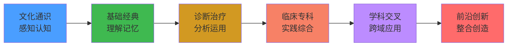

# TCM-AI-Engineering-from-Scratch
## 多智能体协作编写120门中医药教科书 · 智能工程落地中医药领域

> **项目类型**：分布式网络软件工程  
> **技术栈**：Hermes Agent Multi-Agent · GitHub CI/CD · 四层本体论架构  
> **交付物**：①120门递进式教材 ②CI/CD可进化的网络平台  
> **总周期**：18个月（2026.07 - 2028.01）

---

# 第一类交付物：120门学科教材
## 递进顺序符合认知成长

### 一、认知递进架构（六层阶梯）

```
认知层次递进逻辑：

  第六层：前沿创新     → 博后·博士层级（整合·创造）
  第五层：学科交叉     → 博士·硕士层级（跨域·应用）
  第四层：临床专科     → 硕士·本科高年级（实践·综合）
  第三层：诊断治疗     → 本科中年级（分析·运用）
  第二层：基础经典     → 本科低年级（理解·记忆）
  第一层：文化通识     → 全体层级（感知·认知）
```

### 二、120 学科递进顺序表

#### 第一层：文化通识（10 学科）— 感知·认知

| 编号 | 学科 | 院系 | 学分 | 前置 |
|:----:|------|:----:|:----:|:----:|
| CM-01 | 中医基础理论 | D01 | 5 | 无 |
| CM-04 | 中国医学史 | D01 | 2 | 无 |
| CM-03 | 医古文基础 | D01 | 3 | 无 |
| AT-01 | 经络腧穴学 | D03 | 5 | CM-01 |
| MM-04 | 药用植物学 | D02 | 3 | 无 |
| AI-01 | 中医药人工智能导论 | D07 | 3 | 无 |
| MG-01 | 医院管理学 | D08 | 4 | 无 |
| CM-05 | 中医思维方法论 | D01 | 3 | CM-01 |
| CM-06 | 中医文献学 | D01 | 2 | CM-03 |
| CM-07 | 中医经典导读 | D01 | 3 | CM-01 |

#### 第二层：基础经典（15 学科）— 理解·记忆

| 编号 | 学科 | 院系 | 学分 | 前置 |
|:----:|------|:----:|:----:|:----:|
| CM-02 | 中医诊断学 | D01 | 5 | CM-01 |
| MM-01 | 临床中药学 | D02 | 6 | CM-01 |
| MM-02 | 方剂学(上) | D02 | 4 | MM-01 |
| AT-02 | 刺法灸法学 | D03 | 4 | AT-01 |
| CM-09 | 内经选读 | D01 | 4 | CM-01, CM-03 |
| CM-10 | 伤寒论 | D01 | 5 | CM-02 |
| CM-11 | 金匮要略 | D01 | 4 | CM-02 |
| CM-12 | 温病学 | D01 | 4 | CM-02 |
| AT-03 | 针灸治疗学 | D03 | 5 | AT-01 |
| MM-05 | 中药化学 | D02 | 4 | MM-01 |
| MM-06 | 中药药理学 | D02 | 4 | MM-01 |
| MM-07 | 中药鉴定学 | D02 | 3 | MM-04 |
| MM-08 | 中药炮制学 | D02 | 3 | MM-01 |
| TU-01 | 推拿学基础 | D04 | 4 | CM-01, AT-01 |
| OR-01 | 中医骨伤科学基础 | D05 | 4 | CM-01, CM-02 |

#### 第三层：诊断治疗（20 学科）— 分析·运用

| 编号 | 学科 | 院系 | 学分 | 前置 |
|:----:|------|:----:|:----:|:----:|
| CM-13 | 内科学(上) | D01 | 5 | CM-02, MM-01 |
| CM-14 | 内科学(下) | D01 | 5 | CM-13 |
| CM-15 | 外科学 | D01 | 4 | CM-02 |
| CM-16 | 妇科学 | D01 | 4 | CM-13 |
| CM-17 | 儿科学 | D01 | 4 | CM-13 |
| MM-09 | 中药资源学 | D02 | 3 | MM-04 |
| MM-10 | 中药栽培养殖学 | D02 | 3 | MM-04 |
| MM-11 | 中药药剂学 | D02 | 4 | MM-01 |
| MM-12 | 中药分析学 | D02 | 3 | MM-05 |
| MM-13 | 中药调剂学 | D02 | 2 | MM-01 |
| AT-04 | 针灸医籍选读 | D03 | 3 | AT-01, CM-03 |
| AT-05 | 实验针灸学 | D03 | 3 | AT-01 |
| TU-02 | 推拿手法学 | D04 | 5 | TU-01 |
| TU-03 | 推拿诊断学 | D04 | 3 | TU-01, CM-02 |
| TU-04 | 推拿功法学 | D04 | 2 | TU-01 |
| OR-02 | 骨伤诊断学 | D05 | 4 | OR-01 |
| OR-03 | 骨伤影像学 | D05 | 3 | OR-01 |
| OR-04 | 骨伤生物力学 | D05 | 3 | OR-01 |
| OR-05 | 正骨学 | D05 | 5 | OR-02 |
| ENT-01 | 中医眼科学 | D06 | 3 | CM-01, CM-02, CM-13 |

#### 第四层：临床专科（35 学科）— 实践·综合

| 编号 | 学科 | 院系 | 学分 | 前置 |
|:----:|------|:----:|:----:|:----:|
| CM-18 | 急诊学 | D01 | 3 | CM-13 |
| CM-19 | 皮肤科学 | D01 | 2 | CM-13 |
| CM-20 | 男科学 | D01 | 2 | CM-13 |
| CM-21 | 老年病学 | D01 | 2 | CM-13 |
| CM-22 | 肿瘤学 | D01 | 3 | CM-13 |
| AT-06 | 微针疗法 | D03 | 3 | AT-02 |
| AT-07 | 针灸神经科学 | D03 | 3 | AT-05 |
| AT-08 | 针灸康复学 | D03 | 3 | AT-03 |
| AT-09 | 针灸美容 | D03 | 2 | AT-02 |
| AT-10 | 针灸文献学 | D03 | 2 | AT-04 |
| TU-05 | 小儿推拿学 | D04 | 3 | TU-02 |
| TU-06 | 脏腑推拿学 | D04 | 3 | TU-01 |
| TU-07 | 经络推拿学 | D04 | 3 | TU-01 |
| TU-08 | 一指禅推拿 | D04 | 3 | TU-02 |
| TU-09 | 推拿康复学 | D04 | 3 | TU-02 |
| TU-10 | 国际推拿学 | D04 | 2 | TU-02 |
| OR-06 | 筋伤学 | D05 | 4 | OR-02 |
| OR-07 | 骨病学 | D05 | 3 | OR-02 |
| OR-08 | 骨科手术学 | D05 | 4 | OR-05 |
| OR-09 | 关节损伤学 | D05 | 3 | OR-05 |
| OR-10 | 脊柱损伤学 | D05 | 3 | OR-05 |
| OR-11 | 骨伤康复学 | D05 | 3 | OR-05 |
| OR-12 | 骨伤手法学 | D05 | 3 | OR-02 |
| ENT-02 | 中医耳鼻喉科学 | D06 | 3 | CM-13 |
| ENT-03 | 中医口腔科学 | D06 | 2 | CM-01, CM-02 |
| ENT-04 | 喉科学 | D06 | 2 | CM-13 |
| ENT-05 | 五官科护理学 | D06 | 2 | CM-02 |
| ENT-06 | 中西医结合眼科学 | D06 | 3 | ENT-01 |
| ENT-07 | 中西医结合耳鼻喉科学 | D06 | 3 | ENT-02 |
| MG-02 | 中医药经济学 | D08 | 3 | MG-01 |
| MG-03 | 中医药市场营销 | D08 | 3 | MG-01 |
| MG-04 | 中医药政策与法规 | D08 | 2 | MG-01 |
| MG-05 | 医疗机构管理 | D08 | 3 | MG-01 |
| MG-06 | 健康管理学 | D08 | 3 | MG-01 |
| MG-07 | 养生管理学 | D08 | 3 | MG-01 |

#### 第五层：学科交叉（25 学科）— 跨域·应用

| 编号 | 学科 | 院系 | 学分 | 前置 |
|:----:|------|:----:|:----:|:----:|
| MM-14 | 中药制剂分析 | D02 | 3 | MM-11 |
| MM-15 | 中药商品学 | D02 | 2 | MM-01 |
| MM-16 | 中药毒理学 | D02 | 2 | MM-06 |
| MM-17 | 药代动力学 | D02 | 3 | MM-06 |
| MM-18 | 生物技术 | D02 | 3 | MM-05 |
| MM-19 | 海洋中药学 | D02 | 2 | MM-01 |
| MM-20 | 民族药学 | D02 | 2 | MM-01 |
| AI-02 | 中医信息学 | D07 | 3 | AI-01 |
| AI-03 | 中医药数据科学 | D07 | 3 | AI-01 |
| AI-04 | 中医知识图谱 | D07 | 3 | AI-01, AI-02 |
| AI-05 | 中医自然语言处理 | D07 | 3 | AI-02 |
| AI-06 | 中医临床决策支持 | D07 | 3 | AI-03, CM-13 |
| AI-07 | 中医影像智能分析 | D07 | 3 | AI-01 |
| AI-08 | 中医电子病历与CDSS | D07 | 3 | AI-06 |
| AI-09 | 中医智能仪器与可穿戴 | D07 | 3 | AI-01 |
| AI-10 | 中医智能康复 | D07 | 3 | AI-09 |
| AI-11 | 计算中医学 | D07 | 4 | AI-04 |
| AI-12 | 数字化诊疗 | D07 | 3 | AI-06 |
| AI-13 | AI伦理与治理 | D07 | 2 | AI-01 |
| AI-14 | 智能药物发现 | D07 | 3 | AI-03, MM-06 |
| CM-23 | 循证医学 | D01 | 3 | CM-13 |
| CM-24 | 中医临床思维 | D01 | 3 | CM-13 |
| AT-11 | 针灸临床研究 | D03 | 3 | AT-05 |
| MG-08 | 公共卫生管理 | D08 | 3 | MG-01 |
| MG-09 | 医保管理 | D08 | 3 | MG-01 |

#### 第六层：前沿创新（15 学科）— 整合·创造

| 编号 | 学科 | 院系 | 学分 | 前置 |
|:----:|------|:----:|:----:|:----:|
| CM-25 | 各家学说 | D01 | 4 | CM-02 |
| CM-26 | 中医学术史 | D01 | 3 | CM-04 |
| CM-27 | 辨证论治体系研究 | D01 | 3 | CM-09 |
| CM-28 | 学科建设与前沿 | D01 | 2 | 全部 |
| AT-12 | 针灸国际传播与标准化 | D03 | 2 | AT-03 |
| ENT-08 | 口腔内科学 | D06 | 3 | ENT-03 |
| ENT-09 | 口腔颌面外科学 | D06 | 3 | ENT-03 |
| ENT-10 | 口腔正畸学 | D06 | 3 | ENT-03 |
| MG-10 | 知识产权与标准化 | D08 | 2 | MG-04 |
| MG-11 | 中医药国际传播 | D08 | 2 | MG-01 |
| MG-12 | 中医药信息管理 | D08 | 3 | MG-01 |
| MG-13 | 中医药人力资源管理 | D08 | 2 | MG-01 |
| MG-14 | 中医药康养产业管理 | D08 | 3 | MG-01 |
| AI-15 | 中医大模型 | D07 | 3 | AI-11, AI-05 |
| AI-16 | AI驱动的中医新药研发 | D07 | 3 | AI-14 |

> **总计**：10 + 15 + 20 + 35 + 25 + 15 = **120 学科**

### 三、认知成长曲线



---

# 第二类交付物：分布式网络软件工程项目
## CI/CD 可进化的网络平台

### 一、平台架构总图

```
┌─────────────────────────────────────────────────────────────────────┐
│                    TCM-AI-Engineering 网络平台                        │
├─────────────────────────────────────────────────────────────────────┤
│                                                                     │
│  ┌──────────────┐  ┌──────────────┐  ┌──────────────┐              │
│  │  前端服务层    │  │  API 服务层   │  │  后端执行层    │              │
│  │              │  │              │  │              │              │
│  │ Nginx :80/443│  │ Hermes API   │  │ 本地 Gateway  │              │
│  │ 看板 HTML    │  │ :8642        │  │ 云服务器GW   │              │
│  │ 管理面板     │  │ OpenAPI/Swagger│  │ 浪潮服务器GW  │              │
│  └──────┬───────┘  └──────┬───────┘  └──────┬───────┘              │
│         │                 │                 │                       │
│         └─────────────────┼─────────────────┘                       │
│                           │                                         │
│                    ┌──────▼───────┐                                 │
│                    │  CI/CD 流水线  │                                 │
│                    │  GitHub       │                                 │
│                    │  Actions      │                                 │
│                    │  G1/G2/G3    │                                 │
│                    └──────┬───────┘                                 │
│                           │                                         │
│                    ┌──────▼───────┐                                 │
│                    │  知识存储层    │                                 │
│                    │  Git LFS     │                                 │
│                    │  SQLite Kanban│                                 │
│                    │  OWL 本体    │                                 │
│                    └──────────────┘                                 │
└─────────────────────────────────────────────────────────────────────┘
```

### 二、Hermes Agent 与 CLI 共同进化路径

#### 阶段一：CLI 单兵作战（第1-2月）
```
hermes chat -q "写第2章阴阳学说"
→ 终端输出教材内容
→ 手动复制到 drafts/
→ 手动 git commit
```

**能力成熟度**：🤖 Agent 知如何写 · 👤 人知如何部署

#### 阶段二：Gateway 自动调度（第3-5月）
```
hermes gateway start
→ Dispatcher 60s 轮询看板
→ 自动领取 ready 任务
→ 自动编写 → 自动提交
```

**能力成熟度**：🤖 Agent 自动领取 · 👤 人只做审校

#### 阶段三：CI/CD 流水线（第6-9月）
```
git push origin feat/chapter-02
→ GitHub Actions 自动触发
→ G1 质量门禁检查
→ 自动同步到云服务器
→ 看板实时更新进度
```

**能力成熟度**：🤖 Agent 写入 + 检查 · 👤 人只做 G2/G3

#### 阶段四：多服务器分布式（第10-14月）
```
本机 Windows ←→ 华为云前端 ←→ 浪潮后端
    Gateway         Nginx         CLI Agents
    API Server      看板          编写任务
    Kanban          公网访问      分布式执行
```

**能力成熟度**：🤖 Agent 多节点协作 · 👤 人全局监控

#### 阶段五：自适应进化（第15-18月）
```
基于反馈的自动修订：
学生反馈 → GitHub Issue → Agent 自动分析 → 自动修订 PR
地域季节 → 环境变量 → SOUL.md 自动调整 → 内容自动适配
```

**能力成熟度**：🤖 Agent 自适应迭代 · 👤 人仅战略性决策

### 三、平台组件清单

#### 3.1 前端服务（公网可访问）

| 组件 | 技术 | 地址 | 用途 |
|:----|:----|:----|:------|
| **统筹看板** | HTML+CSS+JS | `:8000` | 三方协作·进度追踪 |
| **管理面板** | FastAPI+Vue | `:9119` | Hermes 配置管理 |
| **API Server** | aiohttp | `:8642` | OpenAI 兼容接口 |
| **Nginx 代理** | nginx | `:8080` | 静态资源+反向代理 |

#### 3.2 CI/CD 流水线

| 工作流 | 触发器 | 功能 |
|:-------|:-------|:-----|
| `tcm-ci-cd.yml` | push/PR/定时 | 质量检查+每日报告 |
| `tcm-human-review.yml` | 手动触发 | 人机互动评审 |
| `tcm-gate-G1.yml` | PR自动 | 作者自检门禁 |
| `tcm-deploy.yml` | merge master | 自动部署到云服务器 |

#### 3.3 四层 Agent Profile

| Profile | 角色 | 模型 | 后端 | 工具集 |
|:--------|:----|:----:|:----|:-------|
| `tcm-chief-editor` | L1 行业主编 | deepseek-v4 | 本地 | kanban, terminal |
| `tcm-domain-D01~08` | L2 领域主编 | deepseek-v4 | SSH/浪潮 | kanban, terminal |
| `tcm-subject-Dxx-Sxx` | L3 学科主编 | deepseek-v4 | Daytona | kanban, file |
| `tcm-author` | L4 章节作者 | deepseek-v4-pro | 浪潮·Docker | terminal, file |

#### 3.4 数据存储

| 数据 | 存储方式 | 位置 |
|:----|:---------|:-----|
| 教材草稿 | Git + Markdown | GitHub |
| 领域规范 | Git + Markdown | domain-specs/ |
| 看板任务 | SQLite | ~/.hermes/kanban.db |
| 本体知识 | OWL/RDF | ontology/ |
| 用户配置 | YAML | ~/.hermes/config.yaml |
| 凭证密钥 | .env | ~/.hermes/.env |

### 四、网络拓扑

```
                          Internet
                             │
                     ┌───────▼────────┐
                     │  华为云服务器    │ 114.115.211.254
                     │  Nginx :80/443  │
                     │  Dashboard:8000 │ ← 行业专家/公众评价入口
                     │  Admin Panel:9119│ ← 项目策划人管理入口
                     └───────┬────────┘
                             │
              ┌──────────────┼──────────────┐
              │              │              │
     ┌────────▼───┐  ┌──────▼──────┐  ┌───▼────────┐
     │ 本地 Windows│  │ 浪潮硬服务器  │  │ 华为硬服务器 │
     │ Hermes Gateway│  │ 192.168.1.11 │  │ 192.168.1.12 │
     │ API Server   │  │ L4 ×50并发  │  │ 分布式后端   │
     │ Kanban Disk  │  │ CursorAgent  │  │ 自动启动服务 │
     └─────────────┘  └─────────────┘  └─────────────┘
```

### 五、CI/CD 进化矩阵

| 版本 | CLI 能力 | Gateway 能力 | CI/CD 能力 | 教材完成量 |
|:----:|:---------|:-------------|:-----------|:----------:|
| v0.1 | 单次对话编写 | 未启用 | 无 | 0 章 |
| v0.2 | skill 模板编写 | 手动调度 | G1 门禁 | 10 章 |
| v0.3 | 多轮迭代 | 60s dispatcher | G1+G2 | 50 章 |
| v0.4 | 批量化 | 7 后端分布 | 全自动 | 200 章 |
| v0.5 | 自适应 | 地域季节感知 | CI/CD 闭环 | 500 章 |
| v0.6 | 自我修订 | 反馈驱动 | 全链路 | 800 章 |
| v1.0 | **进化完成** | **网络平台就绪** | **生产级 CI/CD** | **1,600 章** ✅ |

### 六、平台进化里程碑

```
M1（第2月）：CLI 可对话编写第一份教材
  → hermes chat -q "写..."
  → 产出：第1章中医药学导论

M2（第4月）：Gateway 自动调度 + 看板
  → 启动 hermes gateway start
  → 产出：第2-90章（轮次1-2）

M3（第6月）：CI/CD 流水线 + G1/G2 门禁
  → GitHub Actions 自动检查
  → 产出：第91-300章（轮次3）

M4（第10月）：三服务器分布式部署
  → 公网看板 + API 可访问
  → 产出：第301-800章（轮次4-5）

M5（第14月）：自适应修订 + 地域季节适配
  → SOUL.md 根据环境变量调整
  → 产出：第801-1,200章（轮次6）

M6（第18月）：全平台进化完成
  → 120门学科 + CI/CD 网络平台
  → 交付：1,600章 + 分布式系统
```

---

## 项目总览 · 双交付物对照

| 维度 | ① 120门教材 | ② 网络软件平台 |
|:----|:------------|:--------------|
| **本质** | 知识产品 | 技术基础设施 |
| **递进逻辑** | 认知成长（感知→创造） | Agent+CLI 共同进化（单兵→自适应） |
| **交付标准** | G3 ≥95/100 | CI/CD 绿跑率 ≥90% |
| **用户** | 本科生·研究生·自学者 | 项目策划人·审稿者·开发者 |
| **管理者** | L1 行业主编 | L1+技术运维 |
| **版本** | 教材 v1.0 | 平台 v1.0 |
| **GitHub** | `tcm-textbook-series` | 同一仓库 `.github/workflows/` |

---

> **一句话总结**：  
> **120门递进教材**满足「教什么」——从文化通识走到前沿创新；  
> **分布式网络平台**实现「怎么教」——从CLI对话进化到CI/CD自适应。  
> 两者互为表里，共同构成中医药智能工程的完整交付。  
> 项目地址：**http://114.115.211.254:8000**
